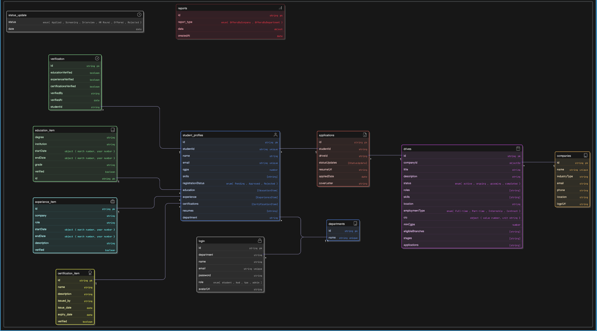

# ZAPDOS-HACKATHON

The **ZapDose Connect ** is a modern web application built using **Next.js 14 + TypeScript**.  
It provides role-based dashboards for **Students**, **TPOs (Training & Placement Officers)**, and **HODs (Heads of Departments)**  
to manage and track campus placement activities seamlessly.

---
# 👥 Zapdos Connect — User Stories

A centralized platform for **Campus Placement Management**, connecting **Students**, **TPOs**, and **HODs**  
to streamline registration, approvals, company drives, applications, and placement tracking.

---

## 🎯 Overview

The system is designed to:
- Allow **students** to manage their profiles, apply for drives, and track their placement journey.  
- Empower **TPOs (Training & Placement Officers)** to manage companies, drives, and placement data.  
- Enable **HODs (Heads of Departments)** to oversee student approvals and department-level performance.

---

## 🧑‍🎓 Student User Story

### 👤 Role:
A **student** registered in the system and approved by their HOD, who can apply to drives and view offers.

### 🛠️ Key Actions & Backend APIs:

| Action | Description | Backend API Used |
|--------|--------------|------------------|
| **Login to the platform** | Student logs in using email and password. | `login(email, password)` |
| **Fetch student profile** | Load student’s details, education, and resume data. | `getStudentProfile(userId)` |
| **Update profile** | Add education, experience, certifications, and skills. | `updateStudentProfile(userId, profileData)` |
| **View active drives** | Browse active placement opportunities. | `getDrives()` |
| **Apply to a drive** | Submit application with resume and cover letter. | `createApplication(userId, driveId, coverLetter)` |
| **Track application status** | See live updates like *Shortlisted*, *Interviewed*, *Offered*, *Rejected*. | `getApplicationsByStudentId(userId)` |
| **View offers** | Check number of drives that resulted in offers. | Derived from `getApplicationsByStudentId()` statusUpdates |
| **Download resume or update it** | Stored in profile for use during applications. | Part of `StudentProfile` document |

### 💡 Example Flow:
1. Student logs in using the `login` API.  
2. The dashboard loads using `getStudentProfile()` and `getApplicationsByStudentId()`.  
3. Student applies to active drives via `createApplication()`.  
4. Application is inserted into `applications` collection and linked to the drive.  
5. Status updates (Applied → Shortlisted → Offered) appear dynamically.  

---

## 🧑‍💼 TPO (Training and Placement Officer) User Story

### 👤 Role:
A **TPO** manages all placement drives, oversees company collaborations, and tracks the recruitment process across departments.

### 🛠️ Key Actions & Backend APIs:

| Action | Description | Backend API Used |
|--------|--------------|------------------|
| **Login as TPO** | Authenticate using login credentials. | `login(email, password)` |
| **Create new company** | Add company details to the database. | `createCompany(companyData)` |
| **Create new drive** | Define eligibility, departments, and roles. | `createDrive(driveData)` |
| **Fetch all drives** | View all ongoing and completed drives. | `getDrives()` |
| **View all applications** | Monitor student applications per drive. | `getApplications()` / `getApplicationsByDriveId(driveId)` |
| **Check offer statistics** | Generate reports for offers per company or department. | `getOffersByCompany()` / `getOffersByDepartment()` |
| **Verify student documents** | Mark education, experience, and certification as verified. | `verifyEducationItem()` / `verifyExperienceItem()` / `verifyCertificationItem()` |
| **View unverified profiles** | Get a list of students awaiting document verification. | `getUnverifiedProfiles()` |

### 💡 Example Flow:
1. TPO logs in and accesses the dashboard.  
2. Uses `createCompany()` to add a new company.  
3. Sets up placement drives using `createDrive()`.  
4. Students apply — `applications` collection is updated.  
5. The TPO dashboard visualizes drive statistics using `getApplications()` and `getOffersByCompany()`.  
6. TPO verifies profiles via verification APIs to maintain authenticity.  

---

## 👩‍🏫 HOD (Head of Department) User Story

### 👤 Role:
A **HOD** monitors students’ academic and placement status, approves registrations, and views department-level reports.

### 🛠️ Key Actions & Backend APIs:

| Action | Description | Backend API Used |
|--------|--------------|------------------|
| **Login as HOD** | Secure login with credentials. | `login(email, password)` |
| **View students in department** | Load all student profiles under the HOD’s department. | `getStudentProfilesByDepartment(department)` |
| **Approve or reject registrations** | Validate student profiles before TPO sees them. | `approveStudent(studentId)` / `rejectStudent(studentId)` |
| **View pending approvals** | See list of students waiting for approval. | `getPendingApprovals(department)` |
| **Track placement performance** | See offers received by department students. | `getOffersByDepartment(department)` |
| **Identify top-performing students** | Compare based on CGPA and offer counts. | Derived from `getStudentProfilesByDepartment()` and applications |
| **Monitor application status trends** | Track number of students applied, shortlisted, and placed. | Uses `getApplications()` filtered by department |

### 💡 Example Flow:
1. HOD logs in to the system.  
2. Loads department students via `getStudentProfilesByDepartment()`.  
3. Reviews pending approvals using `getPendingApprovals()`.  
4. Approves or rejects profiles with `approveStudent()` or `rejectStudent()`.  
5. Reviews placement rate charts powered by `getOffersByDepartment()`.  
6. Department-level statistics (placed vs unplaced) displayed using frontend charts.  

---

## 🗂️ Data Flow Overview

```text
+-------------------+           +----------------------+           +------------------+
|     Frontend      |  --->     |       Backend        |  --->     |    MongoDB DB    |
| (Next.js + React) |           | (TypeScript APIs)    |           | (Collections)    |
+-------------------+           +----------------------+           +------------------+
         ↓                              ↓                               ↓
   StudentDashboard               getStudentProfile()           studentProfiles
   TPODashboard                   getOffersByCompany()          drives, companies
   HODDashboard                   getPendingApprovals()         applications
```
## 📈 Example System Flow

Student registers → HOD approves profile → TPO verifies → Company drive created
        ↓                         ↓                        ↓
   Student applies           Application added         TPO reviews status
        ↓                         ↓                        ↓
  Offer generated ← Application updated ← Drive statistics refreshed


## 🚀 Tech Stack

| Technology | Purpose |
|-------------|----------|
| **Next.js 14 (App Router)** | Server components, routing, and rendering |
| **TypeScript** | Strong typing and maintainability |
| **Tailwind CSS + shadcn/ui** | Modern, consistent UI components |
| **Lucide Icons** | Beautiful vector icons |
| **Recharts** | Interactive charts and graphs |
| **Next Auth (Custom)** | Role-based authentication |
| **MongoDB API Integration** | Real-time data from backend APIs |

---

## 🧩 Role-Based Dashboards

### 👨‍🎓 Student Dashboard
> Personalized dashboard for students to view their placement journey and active opportunities.

**Features**
- Track **applications**, **offers**, and **active drives**
- View **recent application statuses**
- Explore and apply for **available drives**
- Skeleton loaders for smooth transitions during data fetch

**Preview**


---

### 🧑‍💼 TPO Dashboard
> Administrative interface for managing drives, applications, and placement statistics.

**Features**
- Create and manage **placement drives**
- Track **applications** and **offers** across drives
- View **drive performance** with bar charts
- Quick actions: **Email Generator** and **Drive Creation**
- Monitor **active drives** and **placement reports**

**Charts**
- Drive-wise Applications vs Placed Students
- Offers and Active Drives Summary

**Preview**


---

### 👩‍🏫 HOD Dashboard
> Department-level view to monitor placement activities and approve student registrations.

**Features**
- Track total **students**, **placement rate**, and **offers**
- View **Placed vs. Unplaced** charts
- Monitor **application statuses** with pie charts
- Manage **pending student approvals** efficiently

**Charts**
- Placement Overview (Bar)
- Application Status Breakdown (Pie)
xx
**Preview**


---

# 🏫 ZAPDOS Connect Backend

A **Next.js server-side backend** that connects to a **MongoDB database** for managing users, companies, student profiles, recruitment drives, applications, and reports in a **campus recruitment system**.

---

## 🚀 Overview

This backend handles all CRUD operations and business logic for **Campus Connect**, including:

- **User Authentication**
- **Student Profile Management**
- **Company & Drive Management**
- **Application Tracking**
- **Verification & Approval Workflows**
- **Reports and Analytics**

Built using **TypeScript**, **MongoDB**, and **Next.js server actions**, it provides clean modular APIs to interact with MongoDB collections securely.

---
## 🧩 Database Schema



---

## ⚙️ Technologies Used

| Technology | Purpose |
|-------------|----------|
| **Next.js (App Router)** | Server-side rendering & caching |
| **TypeScript** | Strong typing and maintainability |
| **MongoDB** | Database for users, drives, and profiles |
| **MongoDB Driver** | For connecting and performing queries |
| **Next.js Cache (revalidatePath)** | To refresh pages when data changes |

---

## 🧩 Collections Used

### `users`
Stores authentication data and basic user info.

| Field | Type | Description |
|-------|------|-------------|
| `_id` | ObjectId | Unique identifier |
| `email` | String | User email |
| `password` | String | User password (plaintext in this version — should be hashed) |
| `role` | String | e.g. "student", "tpo", "hod" |

---

### `studentProfiles`
Holds detailed student information.

| Field | Type | Description |
|-------|------|-------------|
| `studentId` | String | Unique student identifier |
| `email` | String | Student’s registered email |
| `department` | String | Department name |
| `education` | Array | List of education records (each with `verified` flag) |
| `experience` | Array | Work or internship history |
| `certifications` | Array | Certifications and achievements |
| `resumeUrl` | String | Link to uploaded resume |
| `registrationStatus` | String | Pending / Approved / Rejected |

---

### `companies`
Stores company details for campus drives.

| Field | Type | Description |
|-------|------|-------------|
| `name` | String | Company name |
| `logoUrl` | String | Path to logo |
| `industry` | String | Industry type |
| `description` | String | About the company |

---

### `drives`
Represents placement or internship drives.

| Field | Type | Description |
|-------|------|-------------|
| `companyId` | ObjectId | Reference to `companies` |
| `title` | String | Drive name |
| `stages` | Array | Recruitment stages |
| `applications` | Array | List of student IDs |
| `status` | String | Active / Closed |

---

### `applications`
Links students to drives they have applied for.

| Field | Type | Description |
|-------|------|-------------|
| `studentId` | String | Reference to student profile |
| `driveId` | String | Reference to drive |
| `statusUpdates` | Array | Tracks status across stages |
| `resumeUrl` | String | Resume of the applicant |
| `coverLetter` | String | Cover letter text |
| `appliedDate` | Date | When the student applied |

---

## 🔑 API Overview

### 👤 **User API**
| Function | Description |
|-----------|--------------|
| `login(email, password)` | Authenticates user credentials |

---

### 🧾 **Student Profile API**
| Function | Description |
|-----------|--------------|
| `getStudentProfile(userId)` | Retrieves student profile by user ID |
| `getStudentProfileByStudentId(studentId)` | Fetch profile via student ID |
| `updateStudentProfile(userId, data)` | Updates profile fields |
| `getStudentProfilesByDepartment(department)` | Get all students by department |

---

### ✅ **Approvals API**
| Function | Description |
|-----------|--------------|
| `getPendingApprovals(department)` | Fetch students awaiting approval |
| `approveStudent(studentId)` | Mark a student as approved |
| `rejectStudent(studentId)` | Mark a student as rejected |

---

### 🏢 **Company API**
| Function | Description |
|-----------|--------------|
| `getCompanies()` | Fetch all companies |
| `getCompanyById(id)` | Fetch single company |
| `createCompany(data)` | Add a new company |

---

### 💼 **Drive API**
| Function | Description |
|-----------|--------------|
| `getDrives()` | Get all drives |
| `getDriveById(id)` | Get drive details |
| `createDrive(data)` | Create new drive entry |

---

### 📝 **Application API**
| Function | Description |
|-----------|--------------|
| `getApplications()` | Fetch all applications |
| `getApplicationsByStudentId(userId)` | Applications for a specific student |
| `getApplicationsByDriveId(driveId)` | Applications under a drive |
| `createApplication(userId, driveId, coverLetter)` | Submit new application |

---

### 📊 **Reports API**
| Function | Description |
|-----------|--------------|
| `getOffersByCompany()` | Count of offers per company |
| `getOffersByDepartment(department?)` | Count of offers per department |

---

### 🕵️ **Verification API**
| Function | Description |
|-----------|--------------|
| `getUnverifiedProfiles(department?)` | Find profiles needing verification |
| `verifyEducationItem(studentId, itemId)` | Mark an education item verified |
| `verifyExperienceItem(studentId, itemId)` | Mark an experience item verified |
| `verifyCertificationItem(studentId, itemId)` | Mark a certification verified |

---

## 🧮 Helper Functions

| Function | Description |
|-----------|--------------|
| `getCollection(name)` | Connects to MongoDB and returns the specified collection |
| `fromMongo(doc)` | Converts `_id` → `id` string format |
| `revalidatePath(path)` | Revalidates Next.js cached pages when data changes |

---

## 🔒 Notes & Recommendations

- Passwords should be **hashed** using `bcrypt` before storage.
- Always use **ObjectId validation** before database operations.
- Use **environment variables** for DB credentials.
- Add **authentication middleware** for secure API access.

---


